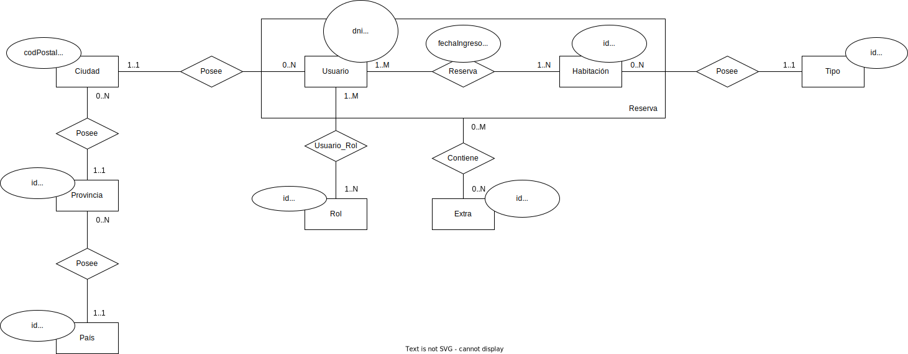

# Propuesta TP TTADS

## Grupo
### Integrantes
* 46812 - Bosio, Rocco

### Repositorios
* [fullstack app](https://github.com/RBosio/tp-ad-ttads-bosio)

## Tema
### Descripción
Sistema de hotelería

### Modelo

## Alcance Funcional 

### Alcance Mínimo

Regularidad:
|Req|Detalle|
|:-|:-|
|CRUD simple|1. CRUD Tipo Habitacion|
|CRUD dependiente|1. CRUD Habitación {depende de} CRUD Tipo Habitacion |
|Listado + detalle| 1. Listado de reservas filtrado por estado muestra nro de habitación, fecha inicio y fin estadía, estado y nombre del cliente => detalle muestra datos completos de la reserva y del cliente|
|CUU/Epic|1. Reservar una habitacion para la estadía|

Adicionales para Aprobación
|Req|Detalle|
|:-|:-|
|CRUD |1. CRUD Tipo Habitacion 2. CRUD Extras 3. CRUD Localidad 4. CRUD Provincia 5. CRUD Pais 6. CRUD Habitación 7. CRUD Cliente 8. CRUD Rol|
|CUU/Epic|1. Reservar una habitación para la estadía 2. Realizar el check-in de una reserva 3. Realizar el check-out y facturación de estadía y servicios|

### Alcance Adicional Voluntario

|Req|Detalle|
|:-|:-|
|Listados ||
|CUU/Epic|1. Cancelación de reserva|
|Otros|1. Carga de imágenes 2. Log de inicio de sesion|