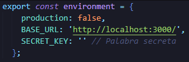

# Frontend


## 💻 Pre-requisitos

- Windows / Linux / Mac.

## 🚀 Instalación

1. En el archivo [environment.ts](./src/environments/environment.ts) setee una palabra secreta


2. Para instalar las dependencias requeridas
```
npm install
```

3. Luego, ejecute el siguiente comando:
```
ng serve
```